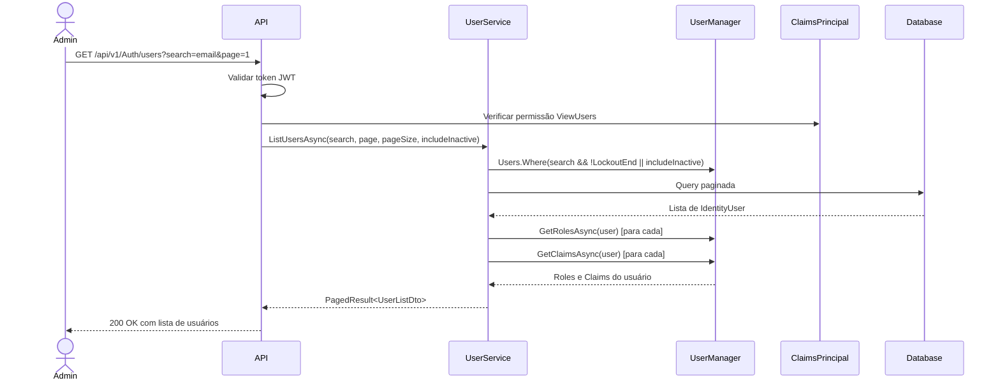
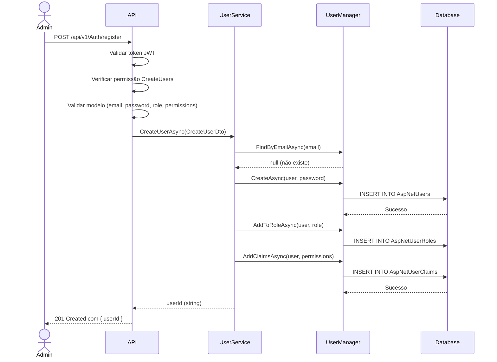
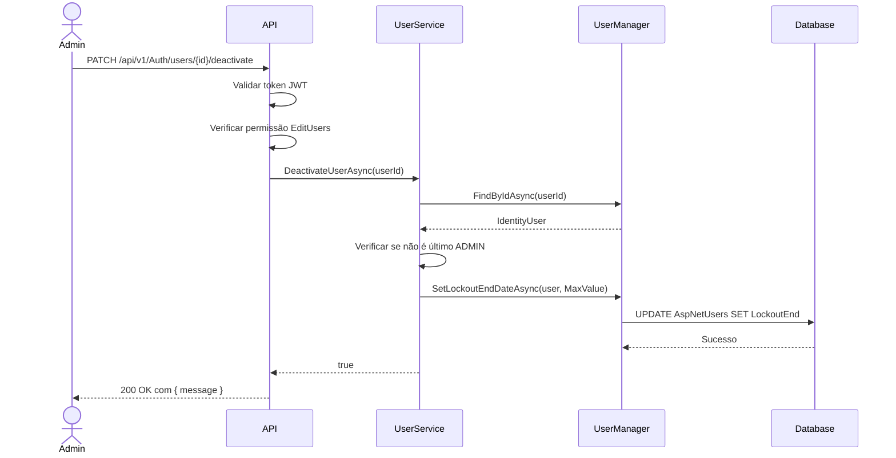
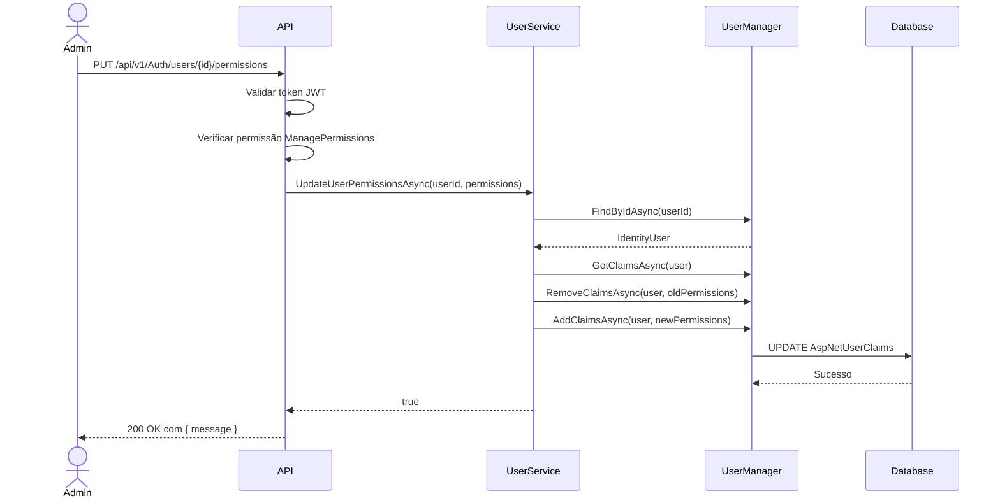

# Feature: Gerenciamento de Usuários

## Objetivo

Implementar funcionalidades de CRUD (Create, Read, Update, Delete) de usuários para permitir que administradores gerenciem contas de acesso ao sistema AutoCarERP, incluindo sistema de perfis, permissões granulares e controle de ativação/desativação de usuários.

---

## Escopo

### Funcionalidades Incluídas
- ✅ Listar todos os usuários com paginação e busca
- ✅ Visualizar detalhes de um usuário específico
- ✅ Criar novos usuários com email, senha e perfil
- ✅ Atualizar perfil de usuários existentes
- ✅ Gerenciar permissões granulares por usuário
- ✅ Ativar/desativar usuários (soft delete)
- ✅ Excluir usuários permanentemente (hard delete)

### Funcionalidades Excluídas (Fora do Escopo)
- ❌ Recuperação de senha por email
- ❌ Autenticação de dois fatores (2FA)
- ❌ Grupos de usuários
- ❌ Auditoria de ações de usuários

---

## Sistema de Perfis e Permissões

### Perfis (Roles)

O sistema possui 3 perfis predefinidos:

| Perfil | Descrição | Permissões Padrão |
|--------|-----------|-------------------|
| **ADMIN** | Administrador do sistema | Todas as permissões |
| **MANAGER** | Gerente | Gestão de clientes, veículos, OS e produtos |
| **USER** | Usuário comum | Visualização e criação básica |

### Permissões Granulares

Cada usuário pode ter permissões específicas além do seu perfil base:

```
Módulo: Clientes
├── ViewClientes       - Visualizar clientes
├── CreateClientes     - Criar clientes
├── EditClientes       - Editar clientes
└── DeleteClientes     - Excluir clientes

Módulo: Veículos
├── ViewVeiculos       - Visualizar veículos
├── CreateVeiculos     - Criar veículos
├── EditVeiculos       - Editar veículos
└── DeleteVeiculos     - Excluir veículos

Módulo: Ordens de Serviço
├── ViewOS             - Visualizar OS
├── CreateOS           - Criar OS
├── EditOS             - Editar OS
├── DeleteOS           - Excluir OS
└── ApproveOS          - Aprovar OS

Módulo: Produtos/Serviços
├── ViewProdutos       - Visualizar produtos
├── CreateProdutos     - Criar produtos
├── EditProdutos       - Editar produtos
└── DeleteProdutos     - Excluir produtos

Módulo: Usuários
├── ViewUsers          - Visualizar usuários
├── CreateUsers        - Criar usuários
├── EditUsers          - Editar usuários
├── DeleteUsers        - Excluir usuários
└── ManagePermissions  - Gerenciar permissões

Módulo: Relatórios
├── ViewReports        - Visualizar relatórios
└── ExportReports      - Exportar relatórios
```

### Matriz de Permissões por Perfil

| Permissão | ADMIN | MANAGER | USER |
|-----------|-------|---------|------|
| ViewClientes | ✅ | ✅ | ✅ |
| CreateClientes | ✅ | ✅ | ✅ |
| EditClientes | ✅ | ✅ | ❌ |
| DeleteClientes | ✅ | ✅ | ❌ |
| ViewOS | ✅ | ✅ | ✅ |
| CreateOS | ✅ | ✅ | ✅ |
| EditOS | ✅ | ✅ | ❌ |
| ApproveOS | ✅ | ✅ | ❌ |
| ViewUsers | ✅ | ❌ | ❌ |
| CreateUsers | ✅ | ❌ | ❌ |
| ManagePermissions | ✅ | ❌ | ❌ |

---

## Regras de Negócio

1. **Autenticação Obrigatória**: Todos os endpoints requerem autenticação via JWT Bearer token
2. **Autorização Restrita**: Apenas usuários com perfil `ADMIN` podem gerenciar usuários
3. **Email Único**: Não é permitido criar usuários com emails duplicados
4. **Senha Forte**: Senha deve ter no mínimo 8 caracteres (validação do Identity)
5. **Perfis Válidos**: Apenas perfis `USER`, `MANAGER` e `ADMIN` são permitidos
6. **Proteção de Admin**: Não é possível desativar ou excluir o último administrador do sistema
7. **Confirmação de Email**: Novos usuários são criados com `EmailConfirmed = true`
8. **Soft Delete**: Usuários desativados não podem fazer login, mas seus dados são preservados
9. **Hard Delete**: Exclusão permanente requer confirmação e só é permitida para ADMIN
10. **Permissões Herdadas**: Usuários herdam permissões do perfil base + permissões customizadas
11. **Login Bloqueado**: Usuários desativados recebem erro específico ao tentar login
12. **Permissões Mutáveis**: ADMIN pode adicionar/remover permissões individuais de qualquer usuário

---

## Fluxo de Negócio

### 1. Listar Usuários



### 2. Criar Usuário com Permissões



### 3. Desativar Usuário (Soft Delete)



### 4. Gerenciar Permissões



---

## Arquitetura Técnica

### Camadas e Responsabilidades

```
┌─────────────────────────────────────────────────┐
│          AutoCarERP.API Layer                   │
│  • AuthController                               │
│  • HTTP Request/Response handling               │
│  • Validação de entrada (ModelState)            │
│  • Autorização ([Authorize] + Claims)           │
│  • Retorno de status codes                      │
└─────────────────────────────────────────────────┘
                    ↓ chama
┌─────────────────────────────────────────────────┐
│      AutoCarERP.Application Layer               │
│  • IUserService (interface)                     │
│  • DTOs (UserListDto, UserDetailDto, etc)       │
│  • Contratos de serviço                         │
└─────────────────────────────────────────────────┘
                    ↓ implementa
┌─────────────────────────────────────────────────┐
│      AutoCarERP.Infra Layer                     │
│  • UserService (implementação)                  │
│  • Lógica de negócio                            │
│  • Integração com UserManager<IdentityUser>     │
│  • Queries e paginação                          │
│  • Gerenciamento de Claims (permissões)         │
└─────────────────────────────────────────────────┘
                    ↓ usa
┌─────────────────────────────────────────────────┐
│      ASP.NET Core Identity                      │
│  • UserManager<IdentityUser>                    │
│  • Gerenciamento de usuários e roles            │
│  • Validação de senha                           │
│  • Claims para permissões granulares            │
│  • LockoutEnd para soft delete                  │
└─────────────────────────────────────────────────┘
```

---

## Estrutura de Arquivos

### Application Layer

```
Application/
├── DTOs/
│   └── User/
│       ├── UserListDto.cs              # DTO para listagem
│       ├── UserDetailDto.cs            # DTO para detalhes
│       ├── CreateUserDto.cs            # DTO para criação
│       ├── UpdateUserPermissionsDto.cs # DTO para permissões (novo)
│       ├── UpdateProfileDto.cs         # (existente)
│       ├── ChangePasswordDto.cs        # (existente)
│       └── UserPreferencesDto.cs       # (existente)
└── Services/
    └── User/
        └── IUserService.cs             # Interface atualizada
```

### Infrastructure Layer

```
Infra/
└── Services/
    └── User/
        └── UserService.cs              # Implementação atualizada
```

### API Layer

```
API/
├── Controllers/
│   └── Auth/
│       └── AuthController.cs           # Controller atualizado
└── Models/
    └── Auth/
        ├── RegisterRequest.cs          # (existente - atualizado)
        ├── UpdateRoleRequest.cs        # (novo)
        └── UpdatePermissionsRequest.cs # (novo)
```

### Core Layer

```
Core/
└── Auth/
    └── Permissions.cs                  # Constantes de permissões (novo)
```

---

## API Specification (OpenAPI 3.0)

### 1. Listar Usuários

```yaml
/api/v1/Auth/users:
  get:
    summary: Lista todos os usuários do sistema
    description: Retorna uma lista paginada de usuários com opção de busca e filtro de ativos/inativos
    tags:
      - User Management
    security:
      - BearerAuth: []
    parameters:
      - name: search
        in: query
        description: Termo de busca para filtrar por email ou username
        required: false
        schema:
          type: string
          example: "admin@autocarerp.local"
      - name: page
        in: query
        description: Número da página (1-based)
        required: false
        schema:
          type: integer
          default: 1
          minimum: 1
          example: 1
      - name: pageSize
        in: query
        description: Quantidade de itens por página
        required: false
        schema:
          type: integer
          default: 20
          minimum: 1
          maximum: 100
          example: 20
      - name: includeInactive
        in: query
        description: Incluir usuários desativados
        required: false
        schema:
          type: boolean
          default: false
          example: false
    responses:
      '200':
        description: Lista de usuários retornada com sucesso
        content:
          application/json:
            schema:
              type: object
              properties:
                items:
                  type: array
                  items:
                    $ref: '#/components/schemas/UserListDto'
                totalCount:
                  type: integer
                  example: 50
                page:
                  type: integer
                  example: 1
                pageSize:
                  type: integer
                  example: 20
      '401':
        description: Não autenticado
      '403':
        description: Não autorizado (sem permissão ViewUsers)
```

### 2. Obter Usuário por ID

```yaml
/api/v1/Auth/users/{id}:
  get:
    summary: Obtém detalhes de um usuário específico
    description: Retorna informações detalhadas de um usuário incluindo perfil, permissões e status
    tags:
      - User Management
    security:
      - BearerAuth: []
    parameters:
      - name: id
        in: path
        description: ID do usuário (GUID)
        required: true
        schema:
          type: string
          format: uuid
          example: "a1b2c3d4-e5f6-7890-1234-567890abcdef"
    responses:
      '200':
        description: Detalhes do usuário retornados com sucesso
        content:
          application/json:
            schema:
              $ref: '#/components/schemas/UserDetailDto'
      '401':
        description: Não autenticado
      '403':
        description: Não autorizado (sem permissão ViewUsers)
      '404':
        description: Usuário não encontrado
```

### 3. Criar Novo Usuário

```yaml
/api/v1/Auth/register:
  post:
    summary: Cria um novo usuário no sistema
    description: Registra um novo usuário com email, senha, perfil e permissões (Admin only)
    tags:
      - User Management
    security:
      - BearerAuth: []
    requestBody:
      required: true
      content:
        application/json:
          schema:
            type: object
            required:
              - email
              - password
              - role
            properties:
              email:
                type: string
                format: email
                description: Email do usuário (será usado como username)
                example: "usuario@autocarerp.local"
              password:
                type: string
                format: password
                minLength: 8
                description: Senha do usuário (mínimo 8 caracteres)
                example: "SenhaForte@123"
              role:
                type: string
                enum: [USER, MANAGER, ADMIN]
                description: Perfil do usuário no sistema
                default: USER
                example: "USER"
              permissions:
                type: array
                items:
                  type: string
                description: Permissões adicionais além do perfil base
                example: ["ViewClientes", "CreateClientes"]
    responses:
      '201':
        description: Usuário criado com sucesso
        content:
          application/json:
            schema:
              type: object
              properties:
                userId:
                  type: string
                  format: uuid
                  description: ID do usuário criado
                  example: "a1b2c3d4-e5f6-7890-1234-567890abcdef"
      '400':
        description: Dados inválidos ou usuário já existe
        content:
          application/json:
            schema:
              type: object
              properties:
                message:
                  type: string
                  example: "Usuário já existe"
      '401':
        description: Não autenticado
      '403':
        description: Não autorizado (sem permissão CreateUsers)
```

### 4. Atualizar Perfil do Usuário

```yaml
/api/v1/Auth/users/{id}/role:
  patch:
    summary: Atualiza o perfil de um usuário
    description: Modifica o perfil (role) de um usuário existente
    tags:
      - User Management
    security:
      - BearerAuth: []
    parameters:
      - name: id
        in: path
        description: ID do usuário
        required: true
        schema:
          type: string
          format: uuid
          example: "a1b2c3d4-e5f6-7890-1234-567890abcdef"
    requestBody:
      required: true
      content:
        application/json:
          schema:
            type: object
            required:
              - role
            properties:
              role:
                type: string
                enum: [USER, MANAGER, ADMIN]
                description: Novo perfil do usuário
                example: "MANAGER"
    responses:
      '200':
        description: Perfil atualizado com sucesso
        content:
          application/json:
            schema:
              type: object
              properties:
                message:
                  type: string
                  example: "Perfil atualizado com sucesso"
      '400':
        description: Dados inválidos
      '401':
        description: Não autenticado
      '403':
        description: Não autorizado (sem permissão EditUsers)
      '404':
        description: Usuário não encontrado
```

### 5. Atualizar Permissões do Usuário

```yaml
/api/v1/Auth/users/{id}/permissions:
  put:
    summary: Atualiza as permissões de um usuário
    description: Define permissões customizadas além do perfil base
    tags:
      - User Management
    security:
      - BearerAuth: []
    parameters:
      - name: id
        in: path
        description: ID do usuário
        required: true
        schema:
          type: string
          format: uuid
          example: "a1b2c3d4-e5f6-7890-1234-567890abcdef"
    requestBody:
      required: true
      content:
        application/json:
          schema:
            type: object
            required:
              - permissions
            properties:
              permissions:
                type: array
                items:
                  type: string
                description: Lista de permissões do usuário
                example: ["ViewClientes", "CreateClientes", "EditClientes", "ViewOS", "CreateOS"]
    responses:
      '200':
        description: Permissões atualizadas com sucesso
        content:
          application/json:
            schema:
              type: object
              properties:
                message:
                  type: string
                  example: "Permissões atualizadas com sucesso"
      '400':
        description: Permissões inválidas
      '401':
        description: Não autenticado
      '403':
        description: Não autorizado (sem permissão ManagePermissions)
      '404':
        description: Usuário não encontrado
```

### 6. Desativar Usuário (Soft Delete)

```yaml
/api/v1/Auth/users/{id}/deactivate:
  patch:
    summary: Desativa um usuário
    description: Desativa o usuário impedindo login, mas preservando dados (soft delete)
    tags:
      - User Management
    security:
      - BearerAuth: []
    parameters:
      - name: id
        in: path
        description: ID do usuário a ser desativado
        required: true
        schema:
          type: string
          format: uuid
          example: "a1b2c3d4-e5f6-7890-1234-567890abcdef"
    responses:
      '200':
        description: Usuário desativado com sucesso
        content:
          application/json:
            schema:
              type: object
              properties:
                message:
                  type: string
                  example: "Usuário desativado com sucesso"
      '400':
        description: Não é possível desativar o último administrador
      '401':
        description: Não autenticado
      '403':
        description: Não autorizado (sem permissão EditUsers)
      '404':
        description: Usuário não encontrado
```

### 7. Reativar Usuário

```yaml
/api/v1/Auth/users/{id}/activate:
  patch:
    summary: Reativa um usuário desativado
    description: Restaura o acesso de um usuário previamente desativado
    tags:
      - User Management
    security:
      - BearerAuth: []
    parameters:
      - name: id
        in: path
        description: ID do usuário a ser reativado
        required: true
        schema:
          type: string
          format: uuid
          example: "a1b2c3d4-e5f6-7890-1234-567890abcdef"
    responses:
      '200':
        description: Usuário reativado com sucesso
        content:
          application/json:
            schema:
              type: object
              properties:
                message:
                  type: string
                  example: "Usuário reativado com sucesso"
      '401':
        description: Não autenticado
      '403':
        description: Não autorizado (sem permissão EditUsers)
      '404':
        description: Usuário não encontrado
```

### 8. Excluir Usuário (Hard Delete)

```yaml
/api/v1/Auth/users/{id}:
  delete:
    summary: Exclui permanentemente um usuário do sistema
    description: Remove permanentemente um usuário (hard delete) - requer confirmação
    tags:
      - User Management
    security:
      - BearerAuth: []
    parameters:
      - name: id
        in: path
        description: ID do usuário a ser excluído
        required: true
        schema:
          type: string
          format: uuid
          example: "a1b2c3d4-e5f6-7890-1234-567890abcdef"
    responses:
      '204':
        description: Usuário excluído com sucesso (sem conteúdo)
      '400':
        description: Não é possível excluir o último administrador ou usuário ativo
      '401':
        description: Não autenticado
      '403':
        description: Não autorizado (sem permissão DeleteUsers)
      '404':
        description: Usuário não encontrado
```

---

## Components / Schemas

```yaml
components:
  securitySchemes:
    BearerAuth:
      type: http
      scheme: bearer
      bearerFormat: JWT
      description: "JWT token obtido via /api/v1/Auth/login"

  schemas:
    UserListDto:
      type: object
      properties:
        id:
          type: string
          format: uuid
          description: ID único do usuário
          example: "a1b2c3d4-e5f6-7890-1234-567890abcdef"
        email:
          type: string
          format: email
          description: Email do usuário
          example: "admin@autocarerp.local"
        userName:
          type: string
          description: Nome de usuário
          example: "admin@autocarerp.local"
        emailConfirmed:
          type: boolean
          description: Se o email foi confirmado
          example: true
        isActive:
          type: boolean
          description: Se o usuário está ativo
          example: true
        role:
          type: string
          description: Perfil do usuário
          example: "ADMIN"
        permissions:
          type: array
          items:
            type: string
          description: Permissões customizadas do usuário
          example: ["ViewClientes", "CreateClientes"]

    UserDetailDto:
      type: object
      properties:
        id:
          type: string
          format: uuid
          example: "a1b2c3d4-e5f6-7890-1234-567890abcdef"
        email:
          type: string
          format: email
          example: "admin@autocarerp.local"
        userName:
          type: string
          example: "admin@autocarerp.local"
        emailConfirmed:
          type: boolean
          example: true
        isActive:
          type: boolean
          example: true
        role:
          type: string
          example: "ADMIN"
        permissions:
          type: array
          items:
            type: string
          example: ["ViewClientes", "CreateClientes", "EditClientes"]
        createdAt:
          type: string
          format: date-time
          description: Data de criação do usuário
          example: "2025-12-13T14:30:00Z"
        lastLogin:
          type: string
          format: date-time
          description: Data do último login
          example: "2025-12-13T14:30:00Z"
```

---

## Exemplos de Uso

### Exemplo 1: Listar usuários ativos com busca

**Request:**
```http
GET /api/v1/Auth/users?search=admin&page=1&pageSize=10&includeInactive=false
Authorization: Bearer {token}
```

**Response:**
```json
{
  "items": [
    {
      "id": "a1b2c3d4-e5f6-7890-1234-567890abcdef",
      "email": "admin@autocarerp.local",
      "userName": "admin@autocarerp.local",
      "emailConfirmed": true,
      "isActive": true,
      "role": "ADMIN",
      "permissions": ["ManagePermissions"]
    }
  ],
  "totalCount": 1,
  "page": 1,
  "pageSize": 10
}
```

### Exemplo 2: Criar usuário com permissões customizadas

**Request:**
```http
POST /api/v1/Auth/register
Authorization: Bearer {token}
Content-Type: application/json

{
  "email": "gerente@autocarerp.local",
  "password": "SenhaSegura@2025",
  "role": "MANAGER",
  "permissions": ["ViewClientes", "CreateClientes", "EditClientes", "ViewOS", "CreateOS", "ApproveOS"]
}
```

**Response:**
```json
{
  "userId": "b2c3d4e5-f6a7-8901-2345-678901bcdefg"
}
```

### Exemplo 3: Desativar usuário

**Request:**
```http
PATCH /api/v1/Auth/users/b2c3d4e5-f6a7-8901-2345-678901bcdefg/deactivate
Authorization: Bearer {token}
```

**Response:**
```json
{
  "message": "Usuário desativado com sucesso"
}
```

### Exemplo 4: Atualizar permissões

**Request:**
```http
PUT /api/v1/Auth/users/b2c3d4e5-f6a7-8901-2345-678901bcdefg/permissions
Authorization: Bearer {token}
Content-Type: application/json

{
  "permissions": ["ViewClientes", "CreateClientes", "ViewOS"]
}
```

**Response:**
```json
{
  "message": "Permissões atualizadas com sucesso"
}
```

---

## Casos de Erro

### 1. Tentativa de criar usuário duplicado

**Request:**
```http
POST /api/v1/Auth/register
{
  "email": "admin@autocarerp.local",
  "password": "Senha@123",
  "role": "ADMIN"
}
```

**Response:**
```http
HTTP/1.1 400 Bad Request
Content-Type: application/json

{
  "message": "Usuário já existe"
}
```

### 2. Tentativa de desativar último admin

**Request:**
```http
PATCH /api/v1/Auth/users/admin-id/deactivate
```

**Response:**
```http
HTTP/1.1 400 Bad Request
Content-Type: application/json

{
  "message": "Não é possível desativar o último administrador do sistema"
}
```

### 3. Usuário sem permissão tentando criar usuário

**Request:**
```http
POST /api/v1/Auth/register
Authorization: Bearer {token_sem_permissao}
```

**Response:**
```http
HTTP/1.1 403 Forbidden
Content-Type: application/json

{
  "message": "Você não tem permissão para criar usuários"
}
```

### 4. Login de usuário desativado

**Request:**
```http
POST /api/v1/Auth/login
{
  "email": "usuario.desativado@autocarerp.local",
  "password": "senha"
}
```

**Response:**
```http
HTTP/1.1 403 Forbidden
Content-Type: application/json

{
  "message": "Sua conta está desativada. Contate o administrador."
}
```

---

## Testes Sugeridos

### Cenários de Teste de API

1. ✅ **GET /users** - Admin com permissão retorna lista com sucesso
2. ✅ **GET /users** - User sem permissão retorna 403
3. ✅ **GET /users?includeInactive=true** - Retorna usuários ativos e inativos
4. ✅ **GET /users/{id}** - Retorna detalhes incluindo permissões e status
5. ✅ **POST /register** - Admin cria usuário com permissões customizadas
6. ✅ **POST /register** - Email duplicado retorna 400
7. ✅ **POST /register** - Perfil inválido retorna 400
8. ✅ **PATCH /users/{id}/role** - Atualiza perfil com sucesso
9. ✅ **PUT /users/{id}/permissions** - Atualiza permissões customizadas
10. ✅ **PUT /users/{id}/permissions** - Permissão inválida retorna 400
11. ✅ **PATCH /users/{id}/deactivate** - Desativa usuário comum
12. ✅ **PATCH /users/{id}/deactivate** - Último admin retorna 400
13. ✅ **PATCH /users/{id}/activate** - Reativa usuário desativado
14. ✅ **DELETE /users/{id}** - Admin exclui usuário desativado
15. ✅ **DELETE /users/{id}** - Usuário ativo não pode ser excluído
16. ✅ **POST /login** - Usuário desativado não consegue login
17. ✅ **Autorização** - Verificar claim de permissão em cada endpoint

---

## Considerações de Segurança

1. **Autenticação**: Todos os endpoints protected com `[Authorize]`
2. **Autorização Granular**: Claims verificados para permissões específicas
3. **Proteção de Admin**: Validação para não desativar/excluir último ADMIN
4. **Validação de Input**: ModelState validado em todos os endpoints
5. **Senha**: Gerenciada pelo Identity com hash bcrypt
6. **HTTPS Only**: Tokens JWT devem trafegar apenas por HTTPS
7. **Rate Limiting**: Implementar para evitar brute force
8. **Soft Delete**: Preserva dados para auditoria e recuperação
9. **Validação de Permissões**: Permissões inválidas são rejeitadas
10. **Bloqueio de Conta**: Implementado via LockoutEnd do Identity

---

## Dependências

### NuGet Packages (já instalados)
- `Microsoft.AspNetCore.Identity.EntityFrameworkCore`
- `Microsoft.AspNetCore.Authentication.JwtBearer`
- `Microsoft.EntityFrameworkCore`

### Não requer novos packages

---

## Ordem de Implementação

1. **Core Layer**
   - Criar classe Permissions com constantes

2. **Application Layer**
   - Criar DTOs (incluindo permissões)
   - Atualizar IUserService com novos métodos

3. **Infrastructure Layer**
   - Implementar métodos no UserService
   - Adicionar lógica de soft delete
   - Gerenciar claims para permissões

4. **API Layer**
   - Atualizar AuthController com novos endpoints
   - Criar UpdatePermissionsRequest
   - Adicionar validação de claims

5. **Deploy**
   - Atualizar backend no OCI
   - Reiniciar container

---
